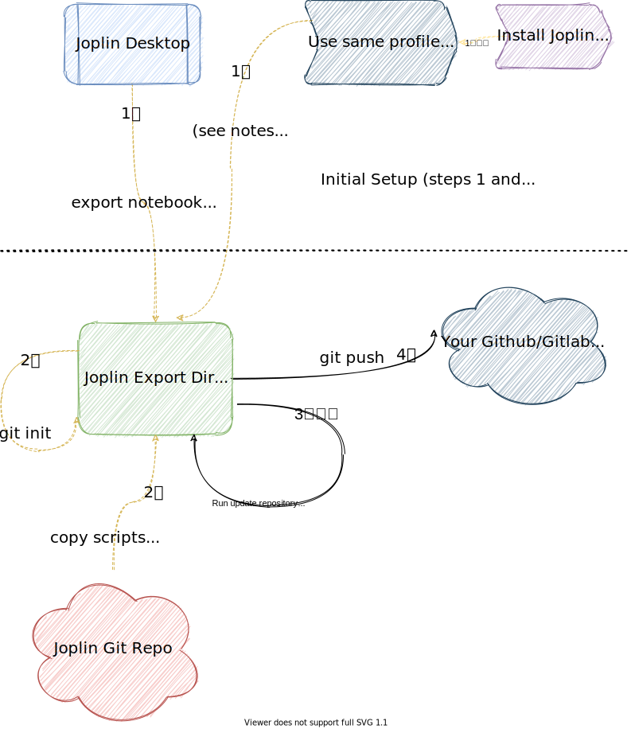
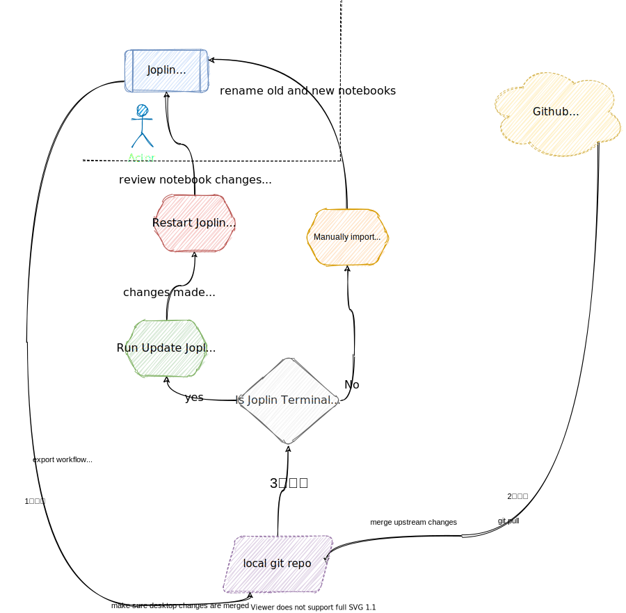

# Visual Workflow





# Pre-requisites

If you are using Joplin Terminal - then make sure you are able to see the same notebooks as Joplin Desktop (assuming you use both).

Here's my workaround (use at your own risk):

```bash
cd $HOME/.config;
mv joplin joplin.bak;
ln -s joplin-desktop joplin;
```


# Simple Case - single user, Joplin Terminal Installed

- relevant script: **bin/update_repository_from_joplin.sh**


# Single User, Joplin Terminal **Not Installed**


# With Collaborators

- Refer to the export part of the workflow in diagrams above

**Caution:**  If you do not have Joplin Terminal Installed and are manually importing, **you will not need the import script**.  However, make sure you import from the subfolder (the one that has the name of your notebook, not the one that has \_resources).  This is a bit different from export, where you import to the root of the repository (I found that slightly confusing when doing manual workflow).

